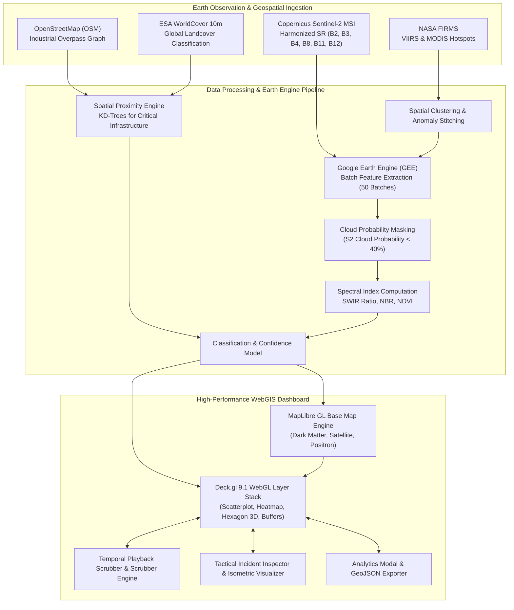

<div align="center">

# 🛰️ AeroThermal-AI
### Multi-Sensor Geospatial Intelligence Platform for Industrial Thermal Anomalies & Wildfire Differentiation

[](https://vitejs.dev/)
[](https://reactjs.org/)
[](https://deck.gl/)
[](https://maplibre.org/)
[](https://earthengine.google.com/)
[](https://tailwindcss.com/)

<p align="center">
  <b>A real-time, GPU-accelerated Earth Observation dashboard discriminating between industrial flare emissions, accidental factory fires, open-cast mining blasts, forest wildfires, and agricultural stubble burning across India.</b>
</p>

</div>

---

## 📌 Overview

Satellite-based active fire monitoring (such as NASA FIRMS VIIRS/MODIS) frequently triggers high-priority alerts across industrial complexes, petroleum refineries, and power generation hubs. However, **raw thermal anomaly detection does not distinguish between standard industrial operations (continuous flare stacks, blast furnaces, smelters) and acute catastrophic factory emergencies or seasonal stubble burning**.

**AeroThermal-AI** solves this challenge through a multi-modal data fusion pipeline combining:
1. **Spaceborne Thermal Radiometry:** NASA FIRMS Fire Radiative Power (FRP) and brightness temperature.
2. **Sentinel-2 MSI Multispectral Validation:** 10m–20m resolution Shortwave Infrared (SWIR Band 11/12), Near Infrared (NIR Band 8), and optical bands with cloud probability masking.
3. **OpenStreetMap (OSM) Infrastructure Topology:** Automated spatial distance calculations to refineries, thermal power plants, chemical manufacturing zones, and mines.
4. **ESA WorldCover 10m Landcover:** High-resolution surface classification (built-up, tree canopy, agricultural parcels, bare quarry).
5. **Interactive 2.5D/3D WebGIS Console:** Deck.gl-powered visualization rendering dynamic heatmaps, 3D hexagonal volumetric bins, proximity safety buffers, and historical temporal playback.

---

## 🚀 Key Features

### 1. Multi-Sensor Data Fusion Engine
- **NASA FIRMS (VIIRS & MODIS):** Real-time ingestion of active thermal points with telemetry including Fire Radiative Power ($FRP_{\max}$, $FRP_{\text{mean}}$), brightness temperature ($K$), detection confidence, and multi-day temporal persistence ratio.
- **Copernicus Sentinel-2 Surface Reflectance (Harmonized):** GEE batch-processing pipeline analyzing pre- and post-event spectral indices to verify thermal intensity and vegetation stress.
- **OpenStreetMap Geo-Infrastructure Layer:** Real-time KD-Tree proximity calculation measuring exact distances to critical industrial assets:
  - $\text{Dist}_{\text{refinery}}$ (Petroleum & Chemical Refineries)
  - $\text{Dist}_{\text{power\_plant}}$ (Thermal / Gas / Hydro Power Stations)
  - $\text{Dist}_{\text{mine}}$ (Open-Cast Coal & Mineral Mines)
  - $\text{Dist}_{\text{industry}}$ (Industrial Estates & Factories)

### 2. Physics-Informed Anomaly Classification
AeroThermal-AI categorizes every thermal occurrence into 5 distinct operational and environmental classes:

| Classification | Severity | Color Code | Diagnostic Fingerprint |
| :--- | :---: | :---: | :--- |
| **Industrial Fire / Incident** | **Critical** | `Crimson (#EF4444)` | Acute thermal surge within industrial boundaries, low SWIR persistence, high immediate FRP. |
| **Gas Flare / Persistent Source** | **Medium** | `Plasma Orange (#F97316)` | Co-located with refinery/flare stack ($<1\text{km}$), multi-week duration, elevated SWIR Band 12 ratio. |
| **Wildfire / Forest Fire** | **High** | `Emerald (#10B981)` | Located in dense tree cover ($>10\text{km}$ from industry), low SWIR ratio, strongly negative NBR. |
| **Agricultural / Stubble Burn** | **Low** | `Amber Yellow (#EAB308)` | Cropland landcover, seasonal cluster, low persistence ($1\text{--}2\text{ days}$). |
| **Mining / Quarry Activity** | **Medium** | `Cyan (#06B6D4)` | Co-located with open-cast extraction zones, bare ground, moderate localized thermal signature. |

### 3. GPU-Accelerated WebGL/WebGPU Deck.gl Visualization
- **Point Scatter Layer:** High-frequency rendering with dynamic color grading and adaptive sizing based on FRP intensity.
- **Heatmap Layer:** Real-time spatial density smoothing identifying regional thermal concentration zones.
- **3D Hexagonal Aggregation:** Volumetric column extrusions reflecting aggregate radiative output across spatial bins.
- **1km / 5km Proximity Buffer Polygons:** Real-time safety perimeter polygons identifying facilities at risk.
- **Multiple Cartographic Basemaps:** Seamless switching between **Carto Dark Matter GIS**, **Esri World Imagery High-Res Satellite**, and **Carto Positron Light**.

### 4. Interactive Temporal Scrubber & Playback
- Chronological time slider spanning multi-month monitoring windows.
- Integrated temporal event histogram displaying daily anomaly counts.
- Dynamic auto-play mode enabling disaster progression tracking and seasonal pattern analysis.

### 5. Tactical Incident Inspector & Visual Telemetry
- **Animated Confidence Arc:** Radial SVG gauge rendering classification confidence.
- **Spectral Diagnostic Cards:**
  - **SWIR Ratio:** Shortwave Infrared ratio indicating high-temperature combustion.
  - **NBR (Normalized Burn Ratio):** $\frac{\text{NIR} - \text{SWIR2}}{\text{NIR} + \text{SWIR2}}$ burn severity estimation.
  - **NDVI (Normalized Difference Vegetation Index):** Canopy health and ground cover status.
- **Procedural 2.5D Isometric Architectural Illustrations:** Contextual architectural schematics dynamically rendered for the nearest infrastructure (Refineries, Thermal Power Plants, Mines, Flare Stacks, General Industry).
- **Proximity Breakdown Gauges:** Real-time distance indicators to all neighboring industrial facility types.

### 6. Analytics Modal & Interoperability
- Interactive **Recharts** visualizations displaying classification breakdowns, FRP distribution, and proximity distance histogram bands.
- **GeoJSON Export Pipeline:** One-click export of filtered thermal anomalies for downstream GIS integration in **QGIS**, **ArcGIS**, or civil defense systems.

---

## 🏛️ System Architecture



---

## 🔬 Spectral Index Diagnostics

For each detected thermal event, multispectral metrics are extracted from Sentinel-2 surface reflectance:

$$\text{SWIR Ratio} = \frac{\rho_{B12}}{\rho_{B11}}$$
> High values ($>1.5$) indicate elevated thermal emissions typical of high-temperature gas flares and industrial furnaces.

$$\text{NBR} = \frac{\rho_{B8} - \rho_{B12}}{\rho_{B8} + \rho_{B12}}$$
> Strongly negative values indicate post-fire burn scars and severe biomass destruction.

$$\text{NDVI} = \frac{\rho_{B8} - \rho_{B4}}{\rho_{B8} + \rho_{B4}}$$
> Identifies vegetation vigor, distinguishing dense forest canopy from cleared extraction grounds or industrial concrete pads.

---

## 🗂️ Project Structure

```text
sih1/
├── index.html                           # Application HTML entry point & typography
├── package.json                         # Project dependencies and build scripts
├── vite.config.js                       # Vite configuration
├── tailwind.config.js                   # Custom design system tokens & theme colors
├── postcss.config.js                   # PostCSS pipeline
├── S2_Full_Extraction_50_Batches.ipynb  # Google Earth Engine batch extraction pipeline
├── thermal_events_with_osm_features.csv # Processed dataset with FIRMS + OSM attributes
├── events_sample.json                   # Enriched thermal event catalog (Geo-features + S2 indices)
└── src/
    ├── main.jsx                         # React root bootstrap
    ├── App.jsx                          # Main application controller, state & filtering logic
    ├── index.css                        # Design system, glassmorphism tokens & map styles
    ├── components/
    │   ├── Header.jsx                   # Navigation, live stats, basemap selector & export
    │   ├── MapViewport.jsx              # Deck.gl + MapLibre GL 2.5D/3D map canvas
    │   ├── FilterPanel.jsx              # Multi-criteria filtering (classification, FRP, proximity, search)
    │   ├── EventInspector.jsx           # Anomaly details drawer, confidence gauge & spectral cards
    │   ├── FacilityIllustrations.jsx    # Procedural 2.5D isometric SVG facility diagrams
    │   ├── TimePlaybackScrubber.jsx     # Temporal scrubber with histogram and auto-play
    │   ├── AnalyticsModal.jsx           # Recharts analytics charts & distribution modal
    │   └── LiveAlertToast.jsx           # Real-time incident alert toast notification
    └── data/
        ├── categories.js                # Classification schema, preset hotspots & basemap configs
        └── events.json                  # Bundled incident payload for fast frontend hydration
```

---

## ⚡ Quick Start & Local Setup

### Prerequisites
- **Node.js**: `v18.0.0` or later
- **npm**: `v9.0.0` or later
- *(Optional for GEE Pipeline)* **Python**: `3.10+` with `earthengine-api` and `pandas`

### Installation

1. **Clone the repository:**
   ```bash
   git clone https://github.com/Hari19hk/sih1.git
   cd sih1
   ```

2. **Install frontend dependencies:**
   ```bash
   npm install
   ```

3. **Launch the development server:**
   ```bash
   npm run dev
   ```
   Open your browser and navigate to `http://localhost:5173`.

4. **Build for production:**
   ```bash
   npm run build
   ```
   The production-ready artifacts will be generated in the `dist/` directory.

5. **Preview the production bundle:**
   ```bash
   npm run preview
   ```

---

## 🛰️ Google Earth Engine Pipeline Execution

The Sentinel-2 extraction workflow is encapsulated in [`S2_Full_Extraction_50_Batches.ipynb`](./S2_Full_Extraction_50_Batches.ipynb):

1. **Earth Engine Authentication:**
   ```python
   import ee
   ee.Authenticate()
   ee.Initialize(project='your-ee-project-id')
   ```
2. **Collection Joining & Cloud Filtering:**
   - Inner joins `COPERNICUS/S2_SR_HARMONIZED` with `COPERNICUS/S2_CLOUD_PROBABILITY`.
   - Applies clear-sky masking where `probability < 40`.
3. **Regional Reducer:**
   - Buffers each thermal coordinate by $100\text{m}$.
   - Samples bands `B2, B3, B4, B8, B11, B12` at $60\text{m}$ scale via `ee.Reducer.mean()` and `ee.Reducer.stdDev()`.
4. **Batch Exports:**
   - Dispatches 50 parallel export tasks to Google Drive for large-scale national coverage.

---

## 🎯 Key Industrial Corridors & Hotspots Monitored

AeroThermal-AI includes instant camera fly-to presets across major Indian industrial complexes:

- **Jamnagar Petrochemical Complex (Gujarat):** World's largest refining hub with continuous hydrocarbon flare stacks.
- **Singrauli Thermal Energy Hub (MP / UP):** Ultra-mega power generation facilities and adjacent coal fields.
- **Angul & Talcher Steel-Coal Belt (Odisha):** Integrated steel plants, blast furnaces, and open-cast mining operations.
- **Korba Industrial & Power Belt (Chhattisgarh):** Thermal power generation and aluminum smelting facilities.
- **Dhanbad & Jharia Coalfields (Jharkhand):** Subterranean and surface coal fire zones requiring continuous thermal monitoring.
- **Hazira Petrochemicals & Port (Gujarat):** LNG terminals, heavy engineering, and chemical production zones.
- **Haldia Industrial Complex (West Bengal):** Coastal petrochemical refineries and logistics corridors.
- **Punjab Agricultural Belt:** Seasonal crop residue burning zones.

---

## 🛠️ Tech Stack & Libraries

- **Framework:** [React 18](https://reactjs.org/) + [Vite](https://vitejs.dev/)
- **Geospatial & 3D Rendering:** [Deck.gl v9](https://deck.gl/) + [MapLibre GL v4](https://maplibre.org/)
- **Styling & UI:** [Tailwind CSS v3](https://tailwindcss.com/) + CSS Glassmorphism
- **Icons & Data Graphics:** [Lucide React](https://lucide.dev/) + [Recharts](https://recharts.org/)
- **Earth Observation Data:** NASA FIRMS, Copernicus Sentinel-2 MSI, OpenStreetMap, ESA WorldCover 10m
- **Remote Sensing Processing:** [Google Earth Engine Python API](https://developers.google.com/earth-engine)

---

## 📄 License

This project is licensed under the [MIT License](LICENSE) - feel free to use and adapt for research, civil defense, or hackathon development.

---

<div align="center">
  <sub>Developed for Smart India Hackathon (SIH) | AeroThermal-AI Geospatial Intelligence</sub>
</div>